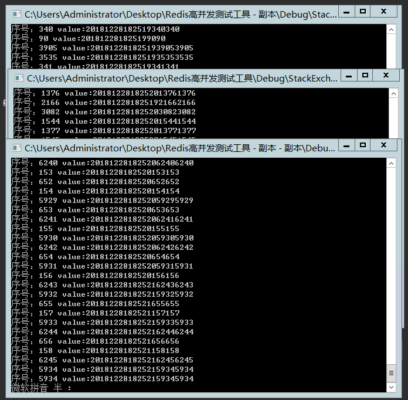

# 20181228工作日报
1. 在Windows下组建Redis集群，并测试主从切换。1主，2从，3哨兵。哨兵配置信息如下
```Bash
#当前Sentinel服务运行的端口
port 26379  
# 哨兵监听的主服务器 
sentinel monitor mymaster 192.168.23.9 6379 2
# 3s内mymaster无响应，则认为mymaster宕机了
sentinel down-after-milliseconds mymaster 3000
#如果10秒后,mysater仍没启动过来，则启动failover  
sentinel failover-timeout mymaster 3000  
# 执行故障转移时， 最多有1个从服务器同时对新的主服务器进行同步
sentinel parallel-syncs mymaster 1
```
2. 修改次卡Bug（5个）
3. 给测试服务器增加Redis压力测试，开三个窗口持续进行Redis读写，以模拟高并发的情况
